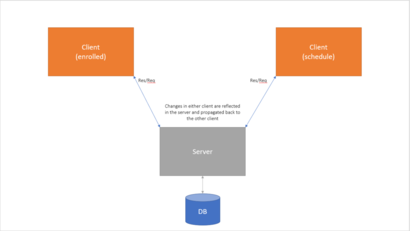

# yesregistrationhelper

## Architecture Diagram and Rationale



Ultimately, the architectural goal of this project is _simplicity_. Most interactions occur on the client via DOM manipulation. These changes are reflected back to the YES server and propagated back to our views appropriately. We don't want to invoke any direct changes to the server ourselves - and we don't have access - meaning client-side modification is the best path for this challenge.

## Language and Framework Choices

This project is being built with vanilla JavaScript. Chrome extensions don't strictly require any external frameworks to be used; this facilitates how lightweight these extensions are. This eases both the development process as well as the load placed on the Chrome brower's runtime to load an extension.

In lieu of using any frameworks, DOM access is being done via JavaScript's native DOM APIs as opposed to JQuery or a similar library. This is
subject to change, but we intend to stay as lightweight and native as possible with this project.

## Coding Standards

This project utilizes ES6 - as such, any and all optimizations offered by the ES6 standard can and will be used. This project also abides by
[AirBnB's JavaScript style guide](https://github.com/airbnb/javascript).

## Testing

At a high-level, testing this application will involve making sure DOM manipulations are consistent between web pages. In other words, we want to determine that the visual schedule updates synchronously with changes to a class cart - testing is mainly done by validing existence of DOM elements in the client UI.

Testing was completed using [Chai](https://github.com/chaijs/chai), [Sinon-Chrome](https://github.com/acvetkov/sinon-chrome), and [Cheerio](https://github.com/cheeriojs/cheerio).

To run the tests, execute the following from your favorite terminal:

```
cd test
npm run test
```
